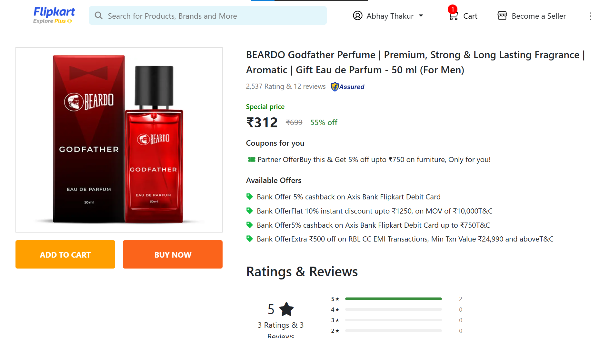
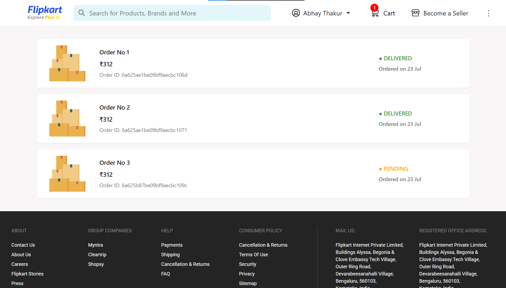
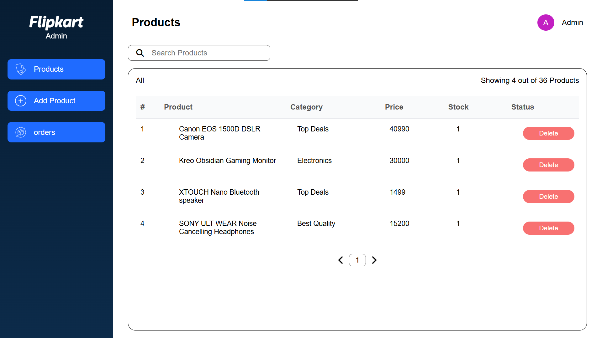

<div align="center">

# 🛒 Flipkart Clone

### A Production-Grade Full-Stack E-Commerce Platform

<p>Built with the <strong>MERN Stack</strong> · Real Payments · OTP Auth · Cloud Storage · CI/CD · Docker</p>

<br/>

[](https://react.dev)
[](https://nodejs.org)
[](https://mongodb.com)
[](https://docker.com)
[](https://razorpay.com)
[](https://cloudinary.com)
[](https://github.com/features/actions)

<br/>

[](https://flipkart-clone-iblp.onrender.com/)
[](https://github.com/Abhaythakur0o6/Flipkart-Clone/actions/workflows/ci.yml)

</div>

<br/>

> **Hosted on Render free tier** — may take ~30 seconds to wake up on first visit.<br>
> 🔒 **Admin Panel** URL is kept private — [contact the author](#-author) to request access.

<br/>

---

## 📋 Table of Contents

- [✨ Highlights](#-highlights)
- [📸 Screenshots](#-screenshots)
- [🏗️ Architecture](#️-architecture)
- [🌟 Features](#-features)
- [🧰 Tech Stack](#-tech-stack)
- [⚙️ CI/CD Pipeline](#️-cicd-pipeline)
- [📡 API Reference](#-api-reference)
- [🐳 Docker Setup](#-docker-setup)
- [💻 Local Setup](#-local-setup)
- [📁 Project Structure](#-project-structure)
- [🔐 Security](#-security)
- [👨‍💻 Author](#-author)

---

## ✨ Highlights

> This is **not** a tutorial clone — it is a fully architected, real-world application built with production concerns in mind.

<br/>

| | Feature | Description |
|---|---------|-------------|
| 💳 | **Real Payment Gateway** | Razorpay integration with full order lifecycle management |
| 📧 | **OTP Email Verification** | Nodemailer + crypto-generated OTPs with expiry |
| 🔐 | **JWT Authentication** | Secure stateless auth in HTTP-only cookies (XSS-safe) |
| ☁️ | **Cloud Image Uploads** | Multer + Cloudinary CDN pipeline for product images |
| 🛠️ | **Dedicated Admin Panel** | Independent Vite app for managing orders and products |
| 🐳 | **Dockerized Architecture** | Multi-service Docker Compose setup (dev + prod configs) |
| 🤖 | **GitHub Actions CI/CD** | Auto build → GHCR publish → Render deploy on every push |
| 💾 | **Redux Persist** | Cart & user state survives page refreshes |
| 📄 | **Server-Side Pagination** | Efficient data loading for products and orders |
| 🛡️ | **Route Guards** | Protected routes for authenticated users only |
| 📦 | **Monorepo Structure** | Client, Admin, and Server cleanly separated |

---

## 📸 Screenshots

### 🛍️ Storefront

**Home Page** — Category navigation, promotional banner & product listings


<br/>

**Product Detail Page** — Pricing, offers, ratings & reviews, Add to Cart / Buy Now


<br/>

**My Orders** — Order history with live status tracking (Delivered / Pending)


<br/>

### 🛠️ Admin Panel

**Products Management** — Paginated product table with delete functionality


<br/>

**Orders Management** — Full order list with colour-coded status badges


---

## 🏗️ Architecture

```
flipkart-clone/
├── client/                    → React 19 storefront  (Vite · Redux · React Router v7)
├── admin/                     → React 19 admin panel (Vite · React Router v7)
├── server/                    → Node.js + Express 5 REST API
├── docker-compose.yml         → Development orchestration
└── docker-compose.prod.yml    → Production orchestration
```

```
         ┌─────────────────────────┐
         │   Client App  · :5173   │
         │   React + Redux Toolkit │
         └──────────┬──────────────┘
                    │  REST API
         ┌──────────▼──────────────┐      ┌─────────────────┐
         │   Express API  · :5000  │◄────►│    MongoDB      │
         │   Node.js               │      │    Mongoose     │
         └──────────┬──────────────┘      └─────────────────┘
                    │  REST API            ┌─────────────────┐
         ┌──────────▼──────────────┐       │   Cloudinary    │
         │   Admin Panel  · :5174  │       │   Image CDN     │
         │   React                 │       └─────────────────┘
         └─────────────────────────┘
```

---

## 🌟 Features

<details>
<summary><strong>🛍️ Customer Storefront</strong> — click to expand</summary>

<br/>

| Feature | Details |
|---------|---------|
| **Product Browsing** | Category filters, product detail pages, image carousels |
| **Search** | Dynamic product search across catalogue |
| **Cart Management** | Add / remove / update quantity — persisted via Redux Persist |
| **Authentication** | Register, Login, OTP Email Verification, JWT sessions |
| **Checkout & Payment** | Razorpay payment gateway with order creation on success |
| **My Orders** | Full order history with live status tracking |
| **Order Detail** | Per-order breakdown with items, price, and delivery status |
| **Product Reviews** | View and submit product reviews |
| **Responsive Design** | Mobile-friendly layout |

</details>

<details>
<summary><strong>🛠️ Admin Panel</strong> — click to expand</summary>

<br/>

| Feature | Details |
|---------|---------|
| **Product Management** | Add products with Cloudinary image upload, delete products |
| **Order Management** | View all orders with server-side pagination |
| **Order Status Control** | Update status: Pending → Delivered or Rejected in real time |
| **Paginated Tables** | Efficient navigation across large datasets |

</details>

---

## 🧰 Tech Stack

<details open>
<summary><strong>Frontend — Client & Admin</strong></summary>

<br/>

| Technology | Purpose |
|-----------|---------|
| **React 19** | UI framework |
| **Vite** | Blazing-fast build tool and dev server |
| **Redux Toolkit + redux-persist** | Global state with persistence across refreshes |
| **React Router v7** | Client-side routing and navigation |
| **Axios** | HTTP client for API communication |
| **Material UI + Bootstrap 5** | Component library and utility CSS |
| **react-hot-toast** | Non-intrusive toast notifications |
| **react-multi-carousel** | Product image carousels |

</details>

<details open>
<summary><strong>Backend</strong></summary>

<br/>

| Technology | Purpose |
|-----------|---------|
| **Node.js + Express 5** | REST API server |
| **MongoDB + Mongoose** | NoSQL database and ODM |
| **JWT (jsonwebtoken)** | Stateless authentication tokens |
| **bcryptjs** | Secure password hashing |
| **Multer + Cloudinary** | Image upload middleware and CDN storage |
| **Nodemailer + Crypto** | OTP generation and email delivery |
| **Razorpay** | Real payment gateway integration |
| **Cookie-Parser** | HTTP-only cookie management |
| **CORS** | Whitelisted cross-origin resource sharing |

</details>

<details open>
<summary><strong>DevOps</strong></summary>

<br/>

| Technology | Purpose |
|-----------|---------|
| **Docker + Docker Compose** | Multi-service containerization |
| **GitHub Actions** | CI/CD — build, test, publish, and deploy |
| **GitHub Container Registry** | Docker image storage per commit SHA |
| **Nginx** | Static file serving for production builds |
| **Render** | Cloud deployment platform |

</details>

---

## ⚙️ CI/CD Pipeline

[](https://github.com/Abhaythakur0o6/Flipkart-Clone/actions/workflows/ci.yml)

Every push to `main` triggers a fully automated 2-job pipeline:

```
push to main
      │
      ▼
┌─────────────────────────────────┐
│        quality-check            │
│  ✔ Install all dependencies     │
│  ✔ Build Client  (Vite)         │
│  ✔ Build Admin   (Vite)         │
│  ✔ Verify Backend (Node.js)     │
└────────────────┬────────────────┘
                 │  on success
                 ▼
┌─────────────────────────────────┐
│        docker-build             │
│  ✔ Build & push Client image    │
│  ✔ Build & push Admin image     │
│  ✔ Build & push Backend image   │
│    → ghcr.io  (SHA-tagged)      │
│  ✔ Trigger Render deploy hooks  │
└─────────────────────────────────┘
```

| Optimization | Detail |
|-------------|--------|
| **Dependency caching** | npm cache keyed by `package-lock.json` hash |
| **Concurrency groups** | Duplicate runs auto-cancelled on new push |
| **Image tagging** | Tagged with both `latest` and exact commit SHA |
| **Auto-deploy** | Render hooks triggered after successful build |

---

## 📡 API Reference

<details>
<summary><strong>🔑 Auth & Users</strong></summary>

```http
POST   /register          →  Register new user
POST   /login             →  Login · returns JWT in HTTP-only cookie
POST   /logout            →  Logout and clear cookie
GET    /user              →  Get current authenticated user
POST   /send-otp          →  Send OTP to user email
POST   /verify-otp        →  Verify submitted OTP
```

</details>

<details>
<summary><strong>📦 Products</strong></summary>

```http
GET    /allproducts       →  Get all products (paginated)
GET    /product/:id       →  Get single product by ID
POST   /addproduct        →  Add product with image upload   [Admin]
DELETE /deleteproduct/:id →  Delete product by ID            [Admin]
```

</details>

<details>
<summary><strong>🧾 Orders</strong></summary>

```http
POST   /order             →  Place a new order              [Auth]
GET    /allorders         →  Get all orders (paginated)     [Admin]
GET    /customerorders    →  Get current user orders        [Auth]
GET    /singleOrder/:id   →  Get single order detail        [Auth]
PATCH  /order/:id/status  →  Update order status            [Admin]
```

</details>

<details>
<summary><strong>💳 Payments</strong></summary>

```http
POST   /payment           →  Create a Razorpay payment order
```

</details>

---

## 🐳 Docker Setup

Run the **entire stack** with a single command:

```bash
# Development
docker compose up --build

# Production
docker compose -f docker-compose.prod.yml up --build
```

| Service | URL |
|---------|-----|
| 🖥️ Backend API | http://localhost:5000 |
| 🛍️ Client App | http://localhost:5173 |
| 🛠️ Admin Panel | http://localhost:5174 |

---

## 💻 Local Setup

<details>
<summary><strong>Prerequisites</strong></summary>

- Node.js v18+
- MongoDB (local or Atlas)
- Cloudinary account
- Razorpay account

</details>

### 1. Clone

```bash
git clone https://github.com/Abhaythakur0o6/Flipkart-Clone.git
cd Flipkart-Clone
```

### 2. Environment Variables

<details>
<summary><code>server/.env</code></summary>

```env
PORT=5000
MONGO_URL=your_mongodb_connection_string
JWT_SECRET=your_jwt_secret
CLOUDINARY_CLOUD_NAME=your_cloud_name
CLOUDINARY_API_KEY=your_api_key
CLOUDINARY_API_SECRET=your_api_secret
EMAIL_USER=your_email@gmail.com
EMAIL_PASS=your_gmail_app_password
RAZORPAY_KEY_ID=your_razorpay_key
RAZORPAY_KEY_SECRET=your_razorpay_secret
CLIENT_URL=http://localhost:5173
ADMIN_URL=http://localhost:5174
```

</details>

<details>
<summary><code>client/.env</code> & <code>admin/.env</code></summary>

```env
VITE_API_URL=http://localhost:5000
```

</details>

### 3. Install & Run

```bash
npm install        # install root dependencies
npm run dev        # start all services concurrently
```

Or individually:

```bash
cd server && npm run dev   # :5000
cd client && npm run dev   # :5173
cd admin  && npm run dev   # :5174
```

---

## 📁 Project Structure

```
server/
├── controllers/     Route handlers  (auth · products · orders · payments)
├── models/          Mongoose schemas (User · Product · Order · OTP)
├── routes/          Express routers
├── middlewares/     auth.js (JWT) · multer.js (uploads)
├── utils/           wrapAsync — centralised async error handler
├── service/         Cloudinary config
└── server.js        Entry point

client/src/
├── components/      Reusable UI  (Header · Footer · Cart · Sidebar …)
├── pages/           Route pages  (Home · Detail · Cart · Orders …)
├── redux/           Store · slices (user · cart)
├── service/         Axios API functions
└── constants/       Static data & config

admin/src/
├── components/      Sidebar · Navbar · ProductsList (order status modal)
├── pages/           Orders · Products · AddProducts
├── service/         OrderApi
└── context/         ProductContext
```

---

## 🔐 Security

| 🛡️ Practice | Implementation |
|-------------|---------------|
| **Password Hashing** | bcryptjs with salt rounds — never stored plain |
| **Token Storage** | HTTP-only cookies — immune to XSS attacks |
| **Route Protection** | JWT middleware guards all sensitive endpoints |
| **OTP Security** | Single-use, time-limited OTPs via Nodemailer |
| **CORS Policy** | Whitelist-only allowed origins |
| **Input Validation** | Server-side validation on all status updates |
| **Error Handling** | Centralised `wrapAsync` prevents unhandled rejections |

---

## 👨‍💻 Author

<div align="center">

**Abhay Thakur**

[](https://www.linkedin.com/in/abhay-thakur-456716254)
[](https://github.com/Abhaythakur0o6)
[](https://www.instagram.com/abhaythakur_06x)

<br/>

---

*If this project impressed you, a ⭐ would mean a lot!*

*Built with 💙 to demonstrate real-world full-stack engineering.*

</div>
